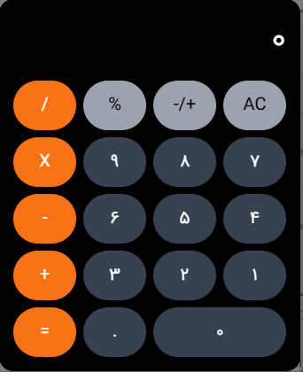

# @mehrzad-ui/shared-components

A growing collection of reusable React components packaged as separate NPM modules. Built with TypeScript and styled using SCSS .

## Packages

### 📦 Calculator

A minimal, responsive calculator component built with React.

#### Screenshot

 
#### Install

```bash
npm install @mehrzad-ui/calculator
# or
yarn add @mehrzad-ui/calculator
# or
pnpm add @mehrzad-ui/calculator
